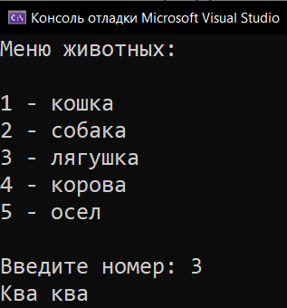
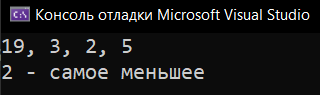

# Practice_6_Operators
Практика: Operators

<a href="https://gist.github.com/SlavikArt/050f27e1af3d0e86b3c824b180fda95a">Gist - страница со всеми кодами проектов</a>

* [Menu_Of_Animals](Menu_Of_Animals)
* [Which_Is_Less](Which_Is_Less)

    <h2>Menu of animals</h2>
    
Меню животных.

    
    <h2>Which is less</h2>
    
Какое число наименьшее.

    

